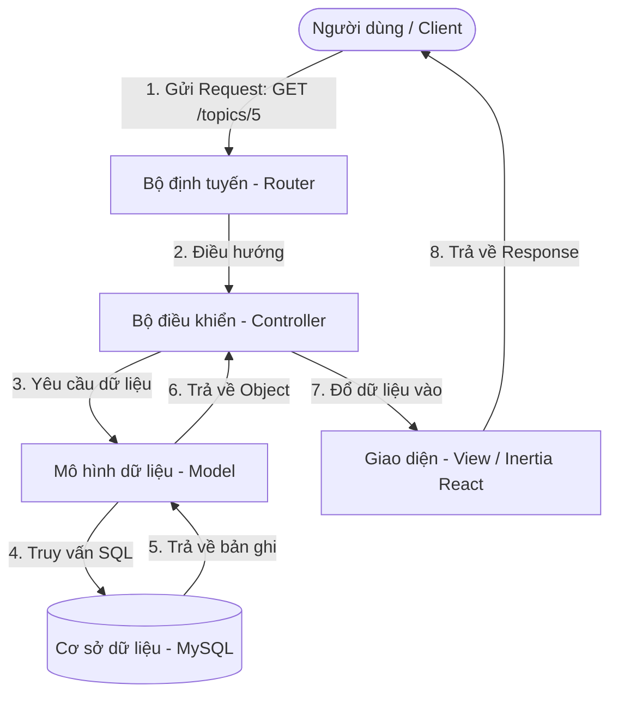

# TÀI LIỆU CĂN BẢN VỀ PHP & LARAVEL CHO NGƯỜI MỚI BẮT ĐẦU

Chào mừng bạn! Nếu bạn là một lập trình viên mới tiếp cận dự án **Chuyen Bien Hoa Youth Online (CYO)** và chưa từng làm việc với **PHP** hoặc **Laravel** trước đây (ví dụ bạn chuyển từ nền tảng Node.js, Python, React thuần...), tài liệu này được thiết kế riêng cho bạn.

Tài liệu này sẽ giúp bạn hiểu được các khái niệm cốt lõi nhất, các thuật ngữ thông dụng và cách vận hành của hệ thống Laravel Backend để bạn có thể tự tin đọc hiểu và phát triển code trong dự án.

---

## 1. PHP Căn Bản: Những điều cần biết ngay

**PHP (Hypertext Preprocessor)** là một ngôn ngữ lập trình kịch bản được chạy ở phía máy chủ (Server-side). Mỗi khi người dùng gọi một URL, máy chủ web (web server) sẽ chạy code PHP để xử lý dữ liệu và trả lại kết quả (thường là HTML hoặc JSON) cho trình duyệt.

### A. Cú pháp PHP cơ bản so với JavaScript

Dưới đây là bảng so sánh nhanh cú pháp giữa PHP và JavaScript để bạn dễ hình dung:

| Đặc trưng | PHP | JavaScript (ES6) |
| :--- | :--- | :--- |
| **Khai báo biến** | Luôn bắt đầu bằng dấu đô-la `$`: `$points = 10;` | Dùng `let`, `const`, hoặc `var`: `const points = 10;` |
| **Nối chuỗi** | Dùng dấu chấm `.`: `'Xin chào ' . $name` | Dùng dấu cộng `+` hoặc backtick: `` `Xin chào ${name}` `` |
| **Mảng (Array)** | `$arr = [1, 2, 3];` | `const arr = [1, 2, 3];` |
| **Mảng kết hợp (Associative Array) / Object** | Dùng mũi tên béo `=>`: `$user = ['name' => 'Nam', 'age' => 17];` | Dùng dấu hai chấm `:`: `const user = {name: 'Nam', age: 17};` |
| **Gọi phương thức/thuộc tính đối tượng** | Dùng mũi tên gầy `->`: `$user->username` | Dùng dấu chấm `.`: `user.username` |
| **Truy cập phần tử tĩnh của Class** | Dùng dấu hai chấm kép `::`: `PointsService::addPoints(...)` | Dùng dấu chấm `.`: `PointsService.addPoints(...)` |

### B. Mảng kết hợp (Associative Arrays) trong PHP
Trong PHP, bạn sẽ thấy kiểu dữ liệu này ở khắp mọi nơi. Nó tương đương với Object trong JavaScript hoặc Dictionary trong Python.
```php
$data = [
    'title' => 'Chào mừng năm học mới',
    'views' => 120,
    'is_active' => true
];

// Cách truy cập phần tử:
echo $data['title']; // In ra: Chào mừng năm học mới
```

### C. Composer là gì?
Nếu bên Node.js có `npm` hay `yarn` để quản lý các package (thư viện), thì bên PHP có **Composer**:
- `composer.json` tương đương với `package.json`.
- Thư mục `vendor/` tương đương với `node_modules/` (chứa toàn bộ mã nguồn của các thư viện bên thứ ba tải về).
- Lệnh `composer install` tương đương với `npm install`.

---

## 2. Laravel là gì?

**Laravel** là một Web Framework viết bằng PHP hoạt động theo mô hình **MVC (Model - View - Controller)**. Nó cung cấp sẵn các công cụ mạnh mẽ để làm việc với Database, bảo mật, xác thực người dùng, gửi mail, real-time... giúp lập trình viên không phải viết lại những tính năng lặp đi lặp lại.

### Mô hình MVC trong Laravel hoạt động như thế nào?

Khi người dùng gửi một yêu cầu (Request) tới hệ thống (ví dụ: click vào xem một bài viết):



1. **Router (Bộ định tuyến):** Nhận request và quyết định xem đoạn code nào (Controller nào) sẽ chịu trách nhiệm xử lý request này. (Định nghĩa tại thư mục `routes/`).
2. **Controller (Bộ điều khiển):** Nhận dữ liệu từ Router, thực hiện kiểm tra logic, yêu cầu Model lấy dữ liệu từ database, sau đó chuyển kết quả cho View hoặc trả về JSON. (Nằm trong `app/Http/Controllers/`).
3. **Model (Mô hình dữ liệu):** Đại diện cho một bảng trong database. Model giúp ta tương tác với dữ liệu bằng ngôn ngữ PHP thay vì viết lệnh SQL dài dòng. (Nằm trong `app/Models/`).
4. **View (Giao diện):** Hiển thị dữ liệu cho người dùng. Trong dự án CYO, thay vì dùng file template Blade của PHP, chúng ta sử dụng **React components** thông qua **Inertia.js** làm View.

---

## 3. Các thành phần quan trọng trong Laravel bạn cần biết

### A. Eloquent ORM (Object-Relational Mapping)
Eloquent là một tính năng cực kỳ mạnh mẽ của Laravel. Nó biến mỗi hàng trong bảng dữ liệu thành một Đối tượng (Object) trong PHP.

Ví dụ, để truy vấn bảng `cyo_auth_accounts` (quản lý tài khoản người dùng), ta dùng Model [AuthAccount](file:///c:/Users/Administrator/Documents/GitHub/cbh-youth-online-api/app/Models/AuthAccount.php):

```php
use App\Models\AuthAccount;

// 1. Lấy tất cả người dùng
$users = AuthAccount::all();

// 2. Tìm người dùng có ID bằng 5
$user = AuthAccount::find(5);
echo $user->username; // Lấy thuộc tính username trực tiếp

// 3. Tìm người dùng theo điều kiện và lấy người đầu tiên
$admin = AuthAccount::where('role', 'admin')->first();

// 4. Tạo một tài khoản mới và lưu vào DB
$newUser = AuthAccount::create([
    'username' => 'nguyenvana',
    'email' => 'ana@example.com',
    'password' => bcrypt('password123'), // mã hóa mật khẩu
    'role' => 'user'
]);
```

#### Quan hệ giữa các Model (Relationships)
Eloquent giúp liên kết các bảng cực kỳ dễ dàng:
- **Một người dùng có một Hồ sơ (One-to-One):** `$user->profile`
- **Một người dùng viết nhiều bài đăng (One-to-Many):** `$user->posts`
- **Một bài đăng thuộc về một người dùng (BelongsTo):** `$post->user`

Các mối quan hệ này được định nghĩa bằng các hàm đặc biệt trong file Model (ví dụ hàm `profile()` và `posts()` trong file [AuthAccount.php](file:///c:/Users/Administrator/Documents/GitHub/cbh-youth-online-api/app/Models/AuthAccount.php)).

---

### B. Migrations (Quản lý phiên bản Database)
Thay vì xuất file `.sql` rồi import thủ công qua phpMyAdmin, Laravel sử dụng **Migrations** để định nghĩa và cập nhật cấu trúc database bằng code PHP.
- Thư mục migrations nằm tại `database/migrations/`.
- Khi bạn chạy lệnh `php artisan migrate`, Laravel sẽ tự động quét thư mục này và tạo các bảng/thêm cột mới vào database MySQL của bạn.
- Mỗi file migration có 2 hàm chính:
  - `up()`: Định nghĩa những gì sẽ được tạo (tạo bảng, thêm cột).
  - `down()`: Định nghĩa cách hoàn tác lại (xóa bảng, xóa cột) nếu cần rollback.

---

### C. Artisan Console (Lệnh CLI của Laravel)
Artisan là giao diện dòng lệnh tích hợp sẵn trong Laravel. Nó cung cấp các lệnh rất hữu ích để hỗ trợ phát triển. Bạn chạy các lệnh này ở thư mục gốc của dự án:

- **Khởi động server phát triển:**
  ```bash
  php artisan serve
  ```
- **Tạo các file code mẫu nhanh chóng:**
  ```bash
  php artisan make:controller ShortVideoController  # Tạo 1 controller mới
  php artisan make:model ShortVideo -m              # Tạo 1 model mới kèm 1 file migration tương ứng
  ```
- **Chạy các thay đổi database:**
  ```bash
  php artisan migrate
  ```
- **Tải dữ liệu thử nghiệm:**
  ```bash
  php artisan db:seed
  ```
- **Xóa cache hệ thống (khi sửa cấu hình env hoặc route mà không thấy nhận):**
  ```bash
  php artisan cache:clear
  php artisan route:clear
  php artisan config:clear
  ```
- **Laravel Tinker (Môi trường tương tác PHP):**
  Lệnh này mở ra một môi trường dòng lệnh cho phép bạn gõ code PHP trực tiếp để test truy vấn Database mà không cần tạo Route hay Controller:
  ```bash
  php artisan tinker
  ```
  *(Ví dụ khi ở trong Tinker, bạn gõ `\App\Models\AuthAccount::count()` và nhấn Enter, hệ thống sẽ trả về số lượng tài khoản trong DB).*

---

### D. Inertia.js - Cầu nối kỳ diệu giữa Laravel và React
Trong dự án này, chúng ta không tách biệt dự án Front-end (React) và Back-end (Laravel API) thành 2 source code chạy ở port độc lập mà tích hợp chung bằng **Inertia.js**:

- **Cách hoạt động:** Khi người dùng truy cập trang diễn đàn, Router của Laravel nhận yêu cầu và chạy một Controller. Thay vì trả về một file JSON thô hay một trang HTML tĩnh, Controller sẽ trả về một lệnh render của Inertia:
  ```php
  // Trong ForumController.php
  return Inertia::render('Forum/Index', [
      'categories' => $forumCategories,
      'statistics' => $stats
  ]);
  ```
- **Phía Client:** Inertia sẽ nhận được tín hiệu này và kích hoạt Component React nằm ở file `resources/js/Pages/Forum/Index.jsx` để vẽ giao diện (View), đồng thời truyền toàn bộ tham số (`categories`, `statistics`) dưới dạng **Props** vào React Component đó.
- Nhờ vậy, bạn có trải nghiệm viết giao diện React Single Page Application (SPA) mượt mà, nhưng việc điều hướng trang, bảo mật và truy vấn dữ liệu vẫn do Laravel Backend quản lý chặt chẽ.

---

## 4. Bản đồ hướng dẫn đọc hiểu code CYO cho người mới

Khi mở dự án CYO, hãy thử thực hành theo luồng đi sau để làm quen:

1. **Bước 1: Tìm hiểu API & Định tuyến**
   Mở file [routes/api.php](file:///c:/Users/Administrator/Documents/GitHub/cbh-youth-online-api/routes/api.php). Đây là nơi định nghĩa toàn bộ đường dẫn API của app.
   - Tìm một dòng route bất kỳ, ví dụ:
     ```php
     Route::get('/points/top-users', [PointsController::class, 'getTopUsers']);
     ```
   - Đoạn code này có nghĩa là: Khi client gửi request `GET /api/v1.0/points/top-users`, Laravel sẽ chuyển tiếp quyền xử lý sang hàm `getTopUsers` của class `PointsController`.

2. **Bước 2: Xem xử lý logic tại Controller**
   Nhấn giữ Ctrl và click vào `PointsController` (hoặc mở file [app/Http/Controllers/PointsController.php](file:///c:/Users/Administrator/Documents/GitHub/cbh-youth-online-api/app/Http/Controllers/PointsController.php)).
   - Tìm hàm `getTopUsers(Request $request)`.
   - Bạn sẽ thấy controller sử dụng Model `AuthAccount` để truy vấn danh sách top 8 người dùng và trả về dưới dạng JSON:
     ```php
     return response()->json($formattedUsers);
     ```

3. **Bước 3: Xem cấu trúc dữ liệu tại Model**
   Mở file [app/Models/AuthAccount.php](file:///c:/Users/Administrator/Documents/GitHub/cbh-youth-online-api/app/Models/AuthAccount.php).
   - Xem cách class định nghĩa bảng cơ sở dữ liệu liên kết: `$table = 'cyo_auth_accounts';`
   - Xem hàm `profile()` định nghĩa quan hệ 1-1 với hồ sơ cá nhân.

---

## 5. Tài liệu & Khóa học khuyên dùng để tăng tốc học tập

Để nhanh chóng làm chủ PHP và Laravel, bạn nên dành thời gian tham khảo các tài nguyên chất lượng dưới đây:

1. **Laracasts (Cực kỳ khuyên dùng - Tiếng Anh):**
   - Trang web [laracasts.com](https://laracasts.com) là nơi học Laravel tốt nhất thế giới.
   - Hãy xem khóa học **"Laravel 8/10/11 From Scratch"** (Hoàn toàn miễn phí). Video rất ngắn gọn, trực quan và dễ hiểu cho người mới bắt đầu.
2. **Tài liệu chính thức (Official Docs):**
   - Học cú pháp PHP cơ bản: [php.net](https://www.php.net/manual/en/langref.php)
   - Đọc hướng dẫn Laravel: [laravel.com](https://laravel.com/docs/10.x) (Chọn phiên bản 10.x phù hợp với dự án).
3. **Inertia.js Documentation:**
   - Xem cách truyền dữ liệu giữa Laravel và React: [inertiajs.com](https://inertiajs.com)

Chúc bạn nhanh chóng làm chủ được dự án và có những đóng góp tuyệt vời cho **Chuyen Bien Hoa Youth Online**! Nếu gặp lỗi hay không hiểu cách thức chạy của một hàm nào đó, đừng ngần ngại chạy `php artisan tinker` để chạy thử nghiệm hoặc kiểm tra file log tại `storage/logs/laravel.log`.
